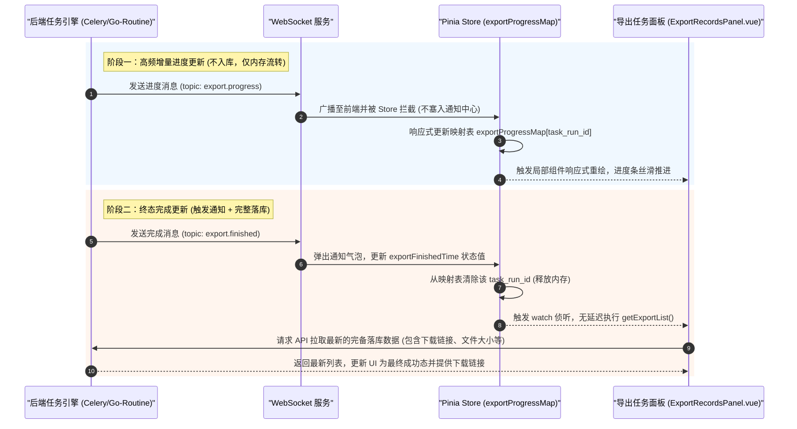

# 异步导出实时进度更新设计方案 (Export Realtime Progress Design)

本方案旨在解决异步导出任务在重试或生成时，前端列表进度更新滞后（依赖被动轮询）的问题。通过升级为 **“WebSocket 增量进度广播 + Pinia 内存响应式状态机映射”** 的通信机制，实现导出进度条像文件上传一样高频、实时、丝滑地推进，同时降低服务器的轮询数据库负载。

---

## 1. 架构时序图



---

## 2. 数据结构设计

### 2.1 增量进度消息负载 (WebSocket Payload)

当后台任务执行中时，高频推送此消息：

```json
{
    "topic": "export.progress",
    "data": {
        "task_run_id": "RUN-2026-9527",
        "progress": 45,
        "stage_name": "正在生成 Excel 数据...",
        "status": "running"
    }
}
```

### 2.2 任务完成终态消息负载 (WebSocket Payload)

当任务完成后发送此消息，触发最终落库刷新与通知提示：

```json
{
    "id": "10023",
    "topic": "export.finished",
    "title": "导出成功",
    "message": "您的文件资源列表已导出成功",
    "level": "success",
    "category": "export",
    "action_url": "/task/center?tab=export",
    "data": {
        "task_run_id": "RUN-2026-9527"
    }
}
```

---

## 3. 前端实现设计

### 3.1 Pinia Store 维护与状态过滤

在 `src/stores/notification.ts` 中维护进行中的任务进度内存映射表，并提供对进度包的过滤拦截：

```typescript
// src/stores/notification.ts
export const useNotificationStore = defineStore('notification', () => {
    // 内存中的进行中任务进度映射表
    const exportProgressMap = ref<Record<string, { progress: number; stage_name: string; status: string }>>({})
    // 任务结束刷新信号
    const exportFinishedTime = ref<number>(0)

    const handleSocketMessage = (event: MessageEvent<string>) => {
        try {
            const payload = JSON.parse(event.data)

            // 1. 拦截增量进度消息：直接更新内存表，终止流转防止污染用户的通知历史中心
            if (payload.topic === 'export.progress' && payload.data) {
                const { task_run_id, progress, stage_name, status } = payload.data
                exportProgressMap.value[task_run_id] = { progress, stage_name, status }
                return
            }

            // 2. 拦截任务终态完成消息：清除内存表缓存，并触发刷新信号
            if (payload.topic === 'export.finished') {
                const taskRunId = payload.data?.task_run_id
                if (taskRunId) {
                    delete exportProgressMap.value[taskRunId]
                }
                exportFinishedTime.value = Date.now()
                // 继续往下走正常逻辑，展示 ElNotification 通知气泡并存入通知列表
            }

            // ...原有通知解析逻辑
        } catch (error) {
            Logger.error('解析 WS 消息失败:', error)
        }
    }

    return {
        exportProgressMap,
        exportFinishedTime,
        // ...其他原有导出项
    }
})
```

### 3.2 组件层的数据覆盖渲染

在 `ExportRecordsPanel.vue` 中，利用计算属性或展示函数将静态列表数据 `exportList` 与 Pinia 的动态高频数据进行混合覆盖展示：

```typescript
// src/views/system/components/ExportRecordsPanel.vue
const notificationStore = useNotificationStore()

// 1. 声明式监听终态刷新信号：一旦完成立刻拉取最新列表，无需依赖轮询
watch(
    () => notificationStore.exportFinishedTime,
    () => {
        void getExportList()
    }
)

// 2. 进度混合渲染：优先读取内存表中的高频进度
const getExportProgress = (row: ExportRecord) => {
    const realtime = notificationStore.exportProgressMap[row.task_run_id]
    if (realtime !== undefined) {
        return realtime.progress
    }
    return getExportRecordProgress(row) // 默认兜底
}

// 3. 任务描述混合渲染
const getExportProgressDescription = (row: ExportRecord) => {
    const realtime = notificationStore.exportProgressMap[row.task_run_id]
    if (realtime !== undefined) {
        return realtime.stage_name
    }
    return row.stage_name || '-'
}

// 4. 任务状态混合渲染 (同步改变 Tag 标签的显示与颜色)
const getExportStatusLabel = (row: ExportRecord) => {
    const realtime = notificationStore.exportProgressMap[row.task_run_id]
    const status = realtime ? realtime.status : row.status
    return exportStatusOptions.value.find((item) => item.value === status)?.label || status || '-'
}

const getExportStatusTagType = (row: ExportRecord) => {
    const realtime = notificationStore.exportProgressMap[row.task_run_id]
    const status = realtime ? realtime.status : row.status
    // 依据 status 返回对应 element-plus 标签类型 ('success' | 'danger' | 'warning' 等)
}
```

---

## 4. 方案优势总结

1. **极致流畅**：进度变化毫秒级反馈，进度条像文件上传一样平滑走动，提升用户交互体验。
2. **极轻量负载**：相比于每 5 秒拉取一次完整的导出记录列表接口（高频查询数据库），增量推送数据载荷小于 100 字节，大幅降低后台 API 压力与网络带宽消耗。
3. **安全免维护**：高频更新完全存放在 Pinia store 内存状态中，任务结束后自动清除内存引用。组件端依赖 Vue 的 `watch` 自动生命周期，组件销毁时监听器随之自动卸载，无任何事件总线未移除而引发内存泄漏的隐患。
