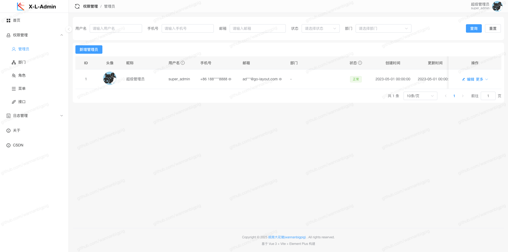

# X-L-Admin-Vue3

<div align="center">


基于 Vue 3 + Vite + Element Plus 的后台管理系统前端。

[在线演示](https://x-l-admin.wannanbigpig.com/) · [后端项目](https://github.com/wannanbigpig/gin-layout) · [API 文档](https://wannanbigpig.apifox.cn/)

</div>



## 项目简介

当前仓库以“动态菜单驱动的后台管理前端”为核心，围绕认证、权限、系统配置、文件中心、任务中心、日志审计和通知中心组织代码。前端通过后端返回的菜单树动态生成业务路由，并在本地统一处理：

- 登录、验证码与 token 静默刷新；
- 菜单路由与按钮权限；
- 中英文切换与主题切换；
- 请求封装、开发期 Mock、全局错误处理；
- WebSocket 通知、导出任务联动；
- 通用列表、表单、上传和字典加载能力。

## 当前功能范围

基于当前 `src/views`、`src/modules` 和 `src/router/componentMap.ts`，项目已包含以下主要页面与模块：

- 首页 / 仪表盘、关于页、个人中心；
- 权限管理：管理员、部门、角色、菜单、API 权限；
- 日志中心：登录日志、请求日志、在线会话；
- 系统中心：系统参数、字典、文件中心、通知发送、任务中心、任务统计；
- 业务示例：产品管理；
- 静态辅助页：登录、404、iframe、refresh。

其中几个关键模块的当前实现特点如下：

- 文件中心支持目录树、分类筛选、网格/表格双视图、文件上传、目录上传、拖拽移动、批量操作、回收站、引用明细和导出。
- 任务中心通过 `definition`、`run`、`cron`、`export` 四个 Tab 组合任务定义、运行记录、Cron 状态和导出记录。
- 通知中心由 Pinia + WebSocket 驱动，带未读数、频道订阅、心跳保活和断线重连。

## 技术栈

- `Vue 3` + `TypeScript`
- `Vite 5`
- `Vue Router 4`
- `Pinia` + `pinia-plugin-persistedstate`
- `Element Plus`
- `Axios`
- `Vue I18n`
- `Vitest`

## 目录结构

```text
src
├── api
├── components
├── composables
├── directives
├── layout
├── locales
├── mock
├── modules
├── router
├── stores
├── types
├── utils
└── views
```

更细的模块和页面映射见：

- [docs/project-overview.md](docs/project-overview.md)
- [docs/runtime-guide.md](docs/runtime-guide.md)

## 环境要求

- `Node.js >= 18`
- `npm >= 9`

## 快速开始

### 1. 安装依赖

```bash
npm install
```

### 2. 启动开发环境

```bash
npm run dev
```

可选启动方式：

```bash
# 读取 .env.location
npm run local

# 使用 production mode 启动 Vite
npm run prod
```

### 3. 构建

```bash
npm run build:dev
npm run build:production
npm run preview
```

### 4. 校验与测试

```bash
npm run type-check
npm run lint
npm run test:run
```

## 环境变量重点

项目已提供 `.env.example`、`.env.development`、`.env.location`、`.env.production`。当前代码实际使用的关键变量包括：

- `VITE_APP_TITLE`
- `VITE_ENABLE_I18N`
- `VITE_DEFAULT_LOCALE`
- `VITE_APP_BASE`
- `VITE_BASE_URL`
- `VITE_BASE_API`
- `VITE_BASE_STATIC`
- `VITE_PROXY_TARGET`
- `VITE_USE_PROXY`
- `AUTO_OPEN_BROWSER`

代码中还支持以下可选变量：

- `VITE_ENABLE_MOCK`
- `VITE_ENABLE_MOCK_FALLBACK`
- `VITE_NOTIFICATION_WS_URL`
- `VITE_IFRAME_ALLOWED_ORIGINS`
- `VITE_DEV_USERNAME`
- `VITE_DEV_PASSWORD`

详细说明见 [docs/runtime-guide.md](docs/runtime-guide.md)。

## 运行机制摘要

- `src/router/guard.ts` 负责登录态校验、静默刷新 token、动态路由注入和页面标题更新。
- `src/router/dynamicRoutes.ts` 负责把后端菜单树转换成前端路由，并过滤按钮节点。
- `src/stores/auth.ts` 负责用户信息、菜单树、按钮权限和 token 生命周期。
- `src/utils/request.ts` 负责请求封装、响应标准化、401 刷新和开发期 Mock。
- `src/stores/notification.ts` 负责通知列表、未读数、WebSocket 心跳和重连。

## 文档导航

- [项目总览](docs/project-overview.md)
- [运行机制说明](docs/runtime-guide.md)

## 验证命令

文档更新后，建议至少执行：

```bash
npm run lint
npm run test:run
```

## 许可证

[MIT](LICENSE)
